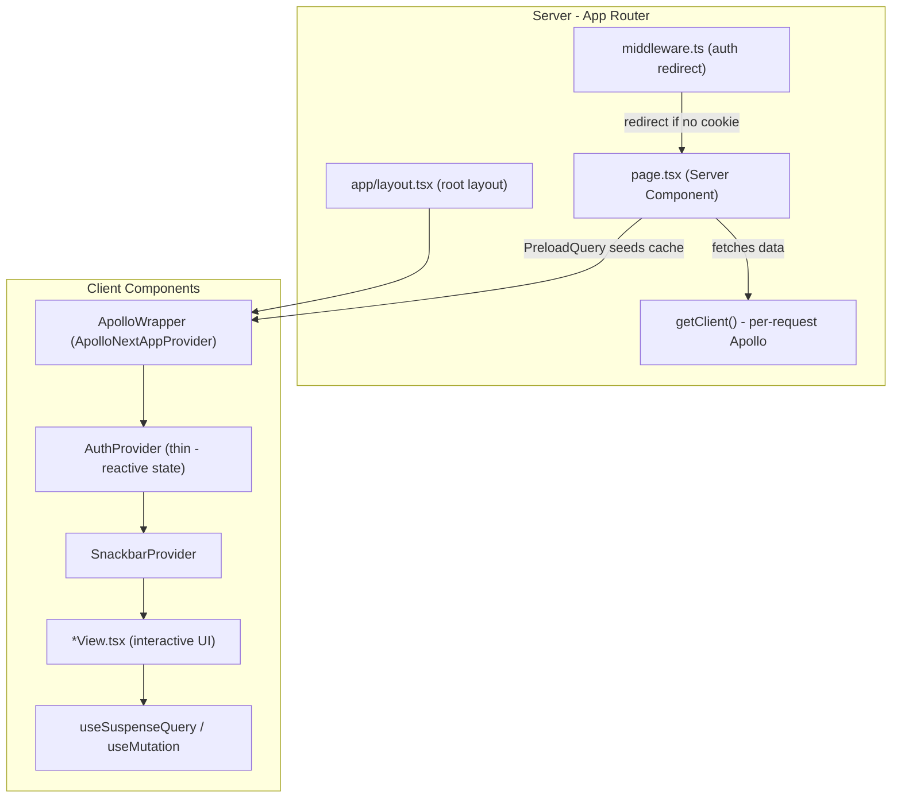

# Frontend Migration Plan: App Router + Mantine v7

## Why This Migration Is Worth It

### The core problem with the current stack

The current architecture has three structural issues that this migration solves completely:

- **Shared Apollo cache between server requests (P0-2):** The module-level `graphqlClient` in `[graphql/apollo.ts](front-end/src/graphql/apollo.ts)` is a singleton shared across concurrent Node.js requests. Data can leak between users. The App Router + `@apollo/client-integration-nextjs` solves this natively — `registerApolloClient` creates an isolated per-request instance automatically.
- `**getServerSideProps` everywhere: Public pages like `[pages/index.tsx](front-end/src/pages/index.tsx)` and `[pages/discover.tsx](front-end/src/pages/discover.tsx)` run a full server-side data fetch on every navigation. With App Router Server Components, these pages become simple `async` functions with built-in caching.
- `**useSearchParams` from `next/navigation` in Pages Router (P1-1): The bug in `[pages/explorer/[city].tsx](front-end/src/pages/explorer/[city].tsx)` disappears entirely — `useSearchParams` is native to the App Router.

### Why this is a genuinely good upgrade

**1. Server Components eliminate boilerplate.**
Instead of the split between `getServerSideProps` (server) and the component (client), a page becomes one async function:

```tsx
// Before (Pages Router)
export const getServerSideProps = async () => {
  const response = await graphqlClient.query({ query: GetActivities });
  return { props: { activities: response.data.getActivities } };
};
export default function Discover({ activities }) { ... }

// After (App Router Server Component)
export default async function Discover() {
  const { data } = await query({ query: GetActivities });
  return <DiscoverView activities={data.getActivities} />;
}
```

**2. Apollo per-request isolation is built in.**
`registerApolloClient` from `@apollo/client-integration-nextjs` handles the SSR singleton problem automatically. No more manual `getApolloClient()` factory.

**3. Streaming SSR with `useSuspenseQuery`.**
Client Components can use `useSuspenseQuery` instead of `useQuery`. React streams the shell immediately and fills in data as it resolves, improving perceived performance.

**4. `PreloadQuery` bridges server → client cache.**
Data fetched in a Server Component can be injected into the client Apollo cache via `PreloadQuery`, eliminating the current pattern where SSR data never reaches the `InMemoryCache`.

**5. Layouts become first-class.**
The current `_app.tsx` wrapper (providers + Topbar + Container) becomes a clean `app/layout.tsx`. Nested layouts (e.g. explorer section vs auth section) are explicit and composable.

**6. Mantine v7 removes the Emotion dependency.**
The current stack requires `@emotion/react`, `@emotion/server`, and `@mantine/next` (Pages Router specific). Mantine v7 uses CSS Modules + PostCSS — no runtime CSS-in-JS, smaller bundle, faster hydration, no `_document.tsx` hack.

**7. Future-proof.**
Pages Router is in maintenance mode. The App Router is where all new Next.js features land.

---

## The Real Difficulties

Being honest about what this costs:

### Difficulty 1: Mantine v6 → v7 is a significant breaking change

**The `createStyles` API is removed.** Every file that calls `createStyles` must be rewritten to CSS Modules.

Files affected:

- `[src/utils/global.styles.ts](front-end/src/utils/global.styles.ts)` — `createStyles` for `link` and `ellipsis` classes
- `[src/components/Topbar/Topbar.styles.ts](front-end/src/components/Topbar/Topbar.styles.ts)` — Topbar-specific styles
- Every component that calls `useGlobalStyles()`: `Activity.tsx`, `ActivityListItem.tsx`, `City.tsx`, and others

**The `sx` prop is removed.** Every `<Box sx={{...}}>` and component `sx={{...}}` must be replaced with inline `style` or `className` with a CSS Module.

Files affected: `withAuth.tsx`, `withoutAuth.tsx`, `SigninForm.tsx`, `SignupForm.tsx`, `ActivityListItem.tsx`, `EmptyData.tsx`.

`**MantineProvider` API changes. `withGlobalStyles` and `withNormalizeCSS` props are removed. CSS normalization is handled by importing `@mantine/core/styles.css` globally.

`**@mantine/next` is removed entirely. The entire `_document.tsx` (which uses `createGetInitialProps` from `@mantine/next`) goes away.

### Difficulty 2: Auth architecture must change

The current `withAuth` / `withoutAuth` HOC pattern works only in Client Components. In App Router:

- **Server-side auth** reads from `cookies()` (from `next/headers`) directly in Server Components or via Next.js Middleware.
- **Client-side auth state** (reactive: show user name in Topbar, logout button) stays in a thin `AuthProvider` Client Component.

The HOCs need to be replaced by a combination of:

- **Middleware** (`middleware.ts`) for redirecting unauthenticated users on protected routes
- `**useAuth` hook in Client Components for reactive display

### Difficulty 3: "use client" boundary discipline

React Server Components cannot use hooks, context, or browser APIs. Every component that uses `useAuth`, `useSnackbar`, Apollo hooks (`useMutation`, `useLazyQuery`), or Mantine form hooks must be marked `"use client"`.

This means pages split into two layers:

- A Server Component (`page.tsx`) that fetches data
- A Client Component (e.g. `DiscoverView.tsx`) that handles interactivity

### Difficulty 4: Apollo v3 → v4 upgrade

`@apollo/client-integration-nextjs` requires `@apollo/client` v4. The v4 migration has some breaking changes (see the [Apollo v4 migration guide](https://www.apollographql.com/docs/react/migrating/apollo-client-4-migration)). Most impactful: the package entry points changed and `useSuspenseQuery` replaces `useQuery` for SSR-aware components.

---

## Architecture After Migration



---

## Migration Phases

### Phase 1: Upgrade Mantine v6 → v7

**Package changes:**

```bash
# Remove
npm uninstall @mantine/next @emotion/react @emotion/server

# Install
npm install @mantine/core@7 @mantine/form@7 @mantine/hooks@7 postcss postcss-preset-mantine
```

**Key file changes:**

1. Delete `[src/pages/_document.tsx](front-end/src/pages/_document.tsx)` — no longer needed
2. Add `postcss.config.cjs` at the project root:

```js
module.exports = {
  plugins: { "postcss-preset-mantine": {}, "postcss-simple-vars": {} },
};
```

1. Import Mantine CSS globally in `_app.tsx` (or later `layout.tsx`):

```ts
import "@mantine/core/styles.css";
```

1. Update `MantineProvider` — remove `withGlobalStyles` and `withNormalizeCSS`:

```tsx
<MantineProvider theme={mantineTheme}>
```

1. Rewrite `utils/global.styles.ts` — `createStyles` → CSS Module:

```css
/* src/utils/global.module.css */
.link {
  text-decoration: none;
}
.ellipsis {
  overflow: hidden;
  text-overflow: ellipsis;
  white-space: nowrap;
}
```

1. Replace all `sx={{...}}` props with inline `style={{...}}` or CSS module `className`
2. Update `MantineThemeOverride` type references per v7 API

### Phase 2: Set Up App Router Foundation

Create the `app/` directory alongside `pages/` (Next.js supports coexistence during migration).

**New files:**

`app/layout.tsx` — replaces `_app.tsx`:

```tsx
import "@mantine/core/styles.css";
import { ColorSchemeScript, MantineProvider } from "@mantine/core";
import { ApolloWrapper } from "@/components/ApolloWrapper";
import { SnackbarProvider } from "@/contexts/snackbarContext";
import { AuthProvider } from "@/contexts/authContext";
import { Topbar } from "@/components";
import { routes } from "@/routes";
import { Container } from "@mantine/core";

export default function RootLayout({
  children,
}: {
  children: React.ReactNode;
}) {
  return (
    <html lang="fr">
      <head>
        <ColorSchemeScript />
      </head>
      <body>
        <MantineProvider theme={mantineTheme}>
          <SnackbarProvider>
            <ApolloWrapper>
              <AuthProvider>
                <Topbar routes={routes} />
                <Container>{children}</Container>
              </AuthProvider>
            </ApolloWrapper>
          </SnackbarProvider>
        </MantineProvider>
      </body>
    </html>
  );
}
```

`app/ApolloWrapper.tsx` — Client Component wrapper:

```tsx
"use client";
import {
  ApolloNextAppProvider,
  ApolloClient,
  InMemoryCache,
} from "@apollo/client-integration-nextjs";
import { HttpLink } from "@apollo/client";

function makeClient() {
  return new ApolloClient({
    cache: new InMemoryCache(),
    link: new HttpLink({
      uri: process.env.NEXT_PUBLIC_GRAPHQL_URL,
      credentials: "include",
    }),
  });
}
export function ApolloWrapper({ children }: React.PropsWithChildren) {
  return (
    <ApolloNextAppProvider makeClient={makeClient}>
      {children}
    </ApolloNextAppProvider>
  );
}
```

`app/ApolloClient.ts` — Server Component client:

```ts
import {
  registerApolloClient,
  ApolloClient,
  InMemoryCache,
} from "@apollo/client-integration-nextjs";
import { HttpLink } from "@apollo/client";

export const { getClient, query, PreloadQuery } = registerApolloClient(
  () =>
    new ApolloClient({
      cache: new InMemoryCache(),
      link: new HttpLink({ uri: process.env.NEXT_PUBLIC_GRAPHQL_URL }),
    }),
);
```

`middleware.ts` — replaces `withAuth` HOC for protected routes:

```ts
import { NextResponse } from "next/server";
import type { NextRequest } from "next/server";

const PROTECTED_ROUTES = ["/profil", "/my-activities", "/activities/create"];

export function middleware(request: NextRequest) {
  const jwt = request.cookies.get("jwt");
  const isProtected = PROTECTED_ROUTES.some((r) =>
    request.nextUrl.pathname.startsWith(r),
  );
  if (isProtected && !jwt) {
    return NextResponse.redirect(new URL("/signin", request.url));
  }
  return NextResponse.next();
}
export const config = {
  matcher: ["/profil", "/my-activities", "/activities/create"],
};
```

### Phase 3: Migrate Pages One by One

Migrate each route from `pages/` to `app/` incrementally. Order: simplest first.

| Route                | `pages/` file                 | `app/` target                    | Type             |
| -------------------- | ----------------------------- | -------------------------------- | ---------------- |
| `/`                  | `pages/index.tsx`             | `app/page.tsx`                   | Server Component |
| `/discover`          | `pages/discover.tsx`          | `app/discover/page.tsx`          | Server Component |
| `/activities/[id]`   | `pages/activities/[id].tsx`   | `app/activities/[id]/page.tsx`   | Server Component |
| `/explorer/[city]`   | `pages/explorer/[city].tsx`   | `app/explorer/[city]/page.tsx`   | Server + Client  |
| `/profil`            | `pages/profil.tsx`            | `app/profil/page.tsx`            | Client Component |
| `/my-activities`     | `pages/my-activities.tsx`     | `app/my-activities/page.tsx`     | Server Component |
| `/signin`            | `pages/signin.tsx`            | `app/signin/page.tsx`            | Client Component |
| `/signup`            | `pages/signup.tsx`            | `app/signup/page.tsx`            | Client Component |
| `/logout`            | `pages/logout.tsx`            | `app/logout/page.tsx`            | Client Component |
| `/activities/create` | `pages/activities/create.tsx` | `app/activities/create/page.tsx` | Client Component |

**Example: `/discover` as a Server Component**

```tsx
// app/discover/page.tsx
import { query } from "@/app/ApolloClient";
import { GetActivities } from "@/graphql/queries/activity/getActivities";
import { DiscoverView } from "./DiscoverView";

export default async function DiscoverPage() {
  const { data } = await query({ query: GetActivities });
  return <DiscoverView activities={data.getActivities} />;
}
```

```tsx
// app/discover/DiscoverView.tsx
"use client";
export function DiscoverView({ activities }) {
  /* interactive UI */
}
```

**Explorer page — keeps client interactivity for filters:**

```tsx
// app/explorer/[city]/page.tsx — Server Component
export default async function CityPage({ params, searchParams }) {
  const { data } = await query({
    query: GetActivitiesByCity,
    variables: {
      city: params.city,
      activity: searchParams.activity,
      price: searchParams.price,
    },
  });
  return (
    <CityExplorer activities={data.getActivitiesByCity} city={params.city} />
  );
}
```

```tsx
// app/explorer/[city]/CityExplorer.tsx — Client Component
"use client";
import { useRouter } from "next/navigation"; // now correct — App Router
import { useSearchParams } from "next/navigation"; // now correct
```

### Phase 4: Cleanup

Once all routes are in `app/`:

- Delete the entire `pages/` directory
- Remove `withAuth` and `withoutAuth` HOCs (replaced by middleware + server-side checks)
- Remove `next/legacy` imports
- Run full test suite and type check

---

## Package Delta

| Action  | Package                                                    |
| ------- | ---------------------------------------------------------- |
| Remove  | `@mantine/next`, `@emotion/react`, `@emotion/server`       |
| Upgrade | `@mantine/core`, `@mantine/form`, `@mantine/hooks` v6 → v7 |
| Upgrade | `@apollo/client` v3 → v4                                   |
| Add     | `@apollo/client-integration-nextjs`                        |
| Add     | `postcss`, `postcss-preset-mantine`, `postcss-simple-vars` |
| Add     | `@tabler/icons-react` latest (icon API may change in v7)   |

---

## Risk Summary

| Risk                                              | Severity | Mitigation                                                       |
| ------------------------------------------------- | -------- | ---------------------------------------------------------------- |
| `createStyles` removal touches many files         | High     | Migrate one component at a time; CSS Modules are straightforward |
| `sx` prop removal across all Mantine components   | High     | Grep for all `sx=` usages upfront; batch replace                 |
| Auth HOC → Middleware requires rethinking session | Medium   | Middleware is simpler than HOCs once written                     |
| Apollo v3 → v4 breaking changes                   | Medium   | Well-documented migration guide; mostly entry point changes      |
| `_document.tsx` removal                           | Low      | Mantine v7 does not need it                                      |
| Test setup may need updates for new import paths  | Low      | Vitest config already needs `@/*` alias fix (P1-5)               |
